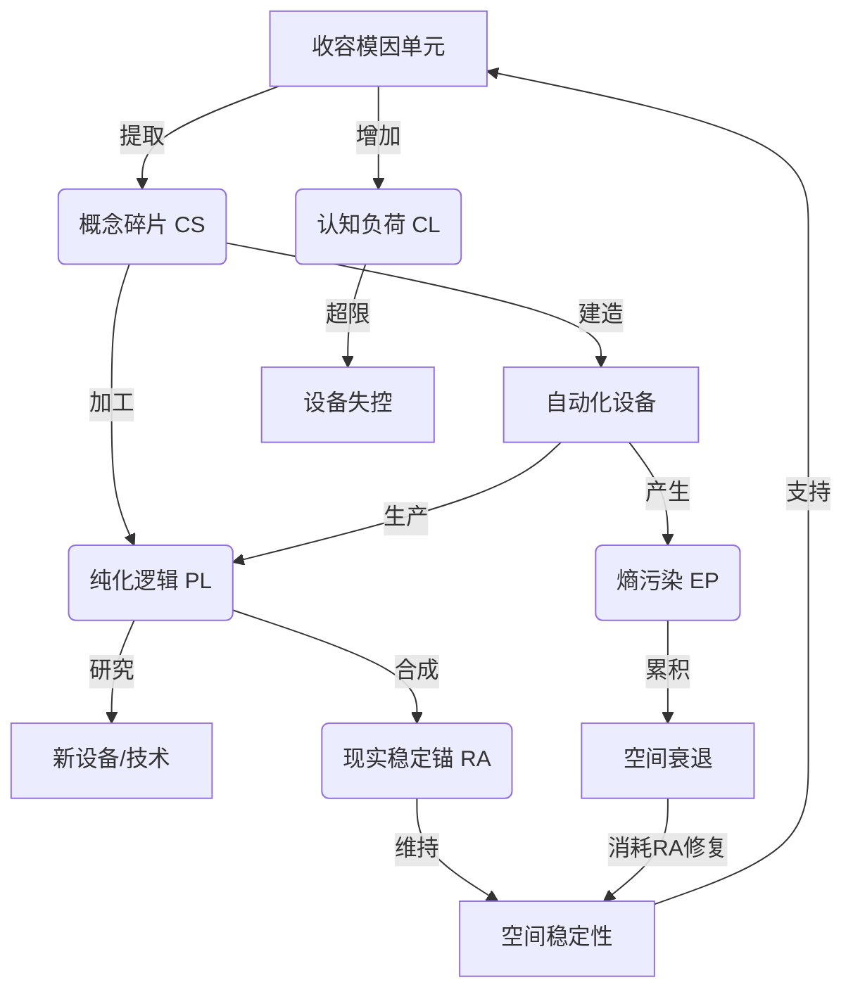
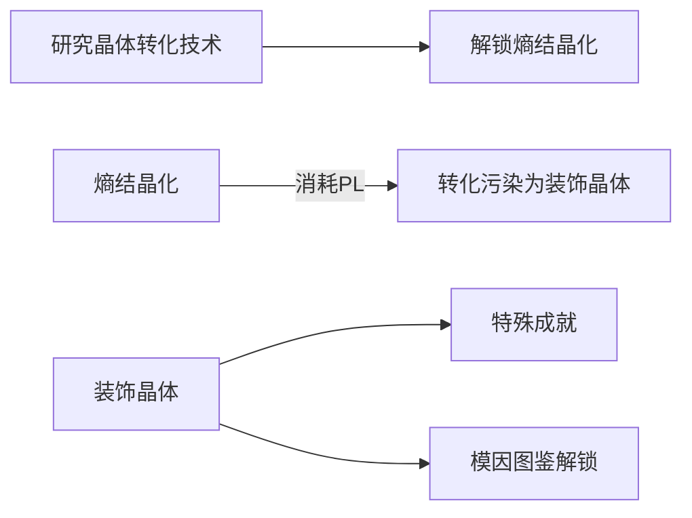

# # 《阈限工厂》完整游戏设计文档（卡牌优化版）

## 一、游戏概述

阈限工厂是一款融合异常收容管理与自动化建设的2D策略模拟游戏。玩家扮演概念工程师，在异空间建造工厂处理逻辑异常体。鉴于单人开发且侧重程序部分，弱化工厂美术资源，更偏向《废墟图书馆》和《小丑牌》，聚焦使用卡牌卡面进行游戏的整体视觉表达。

核心玩法：通过卡牌驱动收容模因单元、提取概念资源、建设自动化流水线、管理多维度资源循环。
核心挑战：平衡生产效率、认知负荷与熵污染威胁。
视觉风格：以AI生成的精美卡牌为主，搭配抽象几何与数据可视化（Unity粒子/Shader驱动）的简洁场景。

## 二、核心资源循环体系

### 1. 五大基础资源

| 资源  | 符号  | 产出途径 | 核心消耗途径 |
| --- | --- | --- | --- |
| 概念碎片 | CS  | 模因单元基础提取（通过“概念碎片提取卡”） | 建造设备/制造稳定锚（使用对应卡牌消耗CS） |
| 纯化逻辑 | PL  | CS流水线加工（“纯化逻辑加工卡”） | 科技研究/污染治理 |
| 现实稳定锚 | RA  | CS + PL合成（“现实稳定锚合成卡”） | 维持空间稳定性 |
| 熵污染 | EP  | 模因泄露/加工错误 | 降低效率/触发事件 |
| 认知负荷 | CL  | 收容模因单元 | 限制操作规模 |

### 2. 资源闭环系统

## 三、关键系统设计

### 1. 模因单元管理

#### 异常特征卡牌化

将模因单元的动态行为模式（递归复制/熵增衰变/逻辑反转）制作成卡牌，每种特征卡牌具有不同效果和能力。玩家收容模因单元时，随机抽取异常特征卡牌，依此制定收容策略。

#### 收容流程卡牌

- 建立概念隔离舱（消耗CS使用“概念隔离舱卡”）
- 执行交互协议（安全/危险等级，“交互协议卡”）
- 提取概念碎片（CS产出量基于风险）

#### 强化系统卡牌

投入PL使用“强化卡”提升模因单元产出效能，不同强化卡有不同强化效果和消耗。

### 2. 自动化流水线建设

#### 设备卡牌

| 设备类型 | 功能  | 建造消耗 | 运行效果 | 熵污染(EP) |
| --- | --- | --- | --- | --- |
| 逻辑提取器 | CS获取 | 50CS | 基础概念采集 | +0.1EP/秒 |
| 精炼矩阵 | CS→PL加工 | 120CS + 20PL | 高阶逻辑转化 | +0.3EP/秒 |
| 锚合成核心 | CS + PL→RA | 200CS + 50PL | 稳定性维护 | +0.2EP/秒 |
| 熵过滤器 | EP净化 | 80PL | 污染清除 | -0.5EP/秒 |

#### 流水线组合策略

玩家合理组合设备卡牌构建高效自动化流水线。如逻辑提取器和精炼矩阵卡牌组合实现CS到PL高效生产；锚合成核心和熵过滤器卡牌组合维持空间稳定并净化EP。

### 3. 多维空间系统

区域划分：收容区/加工区/净化区（各区域独立稳定性）
稳定性机制：

- 基础衰减：每分钟 -1%
- 污染加速：每10EP额外 +0.5%衰减
- 临界阈值：<30%触发区域事故

稳定锚(RA)作用：

- 维持：每RA恢复10%稳定性
- 修复：崩溃区域需10×RA重建

### 4. 认知负荷(CL)限制

容量规则：

- 初始上限：5单位
- 每模因单元：+1CL
- 超限惩罚：当认知负荷卡牌达到一定数量触发“超限事件”，如设备失控等。

扩容途径：研究认知增幅技术（消耗PL）

### 5. 科技树系统

研究原则：消耗PL解锁永久增益
核心分支：

- 效率提升：减少CS/RA消耗
- 污染抑制：降低设备EP产出
- 认知扩容：提高CL上限
- 熵转化：将EP结晶化

## 四、熵污染治理系统

### 1. 污染产生机制

| 污染源 | 污染值 | 特征  |
| --- | --- | --- |
| 高危模因泄露 | +20EP | 突发性事件 |
| 设备过载运行 | +0.5EP/秒 | 持续性累积 |
| 区域崩溃 | +50EP | 链式反应 |

### 2. 污染控制手段

#### 主动净化

- 建造熵过滤器（消耗PL使用对应卡牌）
- 紧急净化（消耗PL直接清除EP）

#### 被动防御

- 隔离屏障（减少区域污染传播）
- 稳定锚储备（延缓崩溃速度）

### 3. 污染转化技术

## 五、终局资源循环设计

### 1. 效率陷阱挑战

扩张悖论：

1. 扩大生产→更多CL/EP
2. 必须投入PL研发缓解技术
3. 技术效率→支撑更大规模

平衡点设计：

- 70%稳定度下最优效率
- 5%PL必须投入污染控制

### 2. 长期发展路径

| 发展阶段 | 资源焦点 | 主要挑战 |
| --- | --- | --- |
| 生存阶段 | RA持续性获取 | 基础稳定性维持 |
| 工业化阶段 | PL规模产出 | 污染指数增长 |
| 终局阶段 | CL上限突破 | 管理复杂度失控 |

### 3. 终局激励

- 熵结晶成就：转化超额EP获得稀有晶体
- 逻辑图鉴：强化特定模因单元需要PL
- 隐藏模因：达到污染转化阈值解锁特殊单元

## 六、卡牌系统设计

### 1. 卡牌类型

#### 资源卡牌

CS、PL、RA、EP、CL以卡牌形式呈现，玩家通过收集和使用管理资源。

#### 功能卡牌

- 模因单元相关卡牌（异常特征卡、收容流程卡、强化卡）
- 设备卡牌（逻辑提取器卡、精炼矩阵卡等）
- 战斗卡牌（净化卡牌对抗熵污染）
- 剧情卡牌（解锁游戏故事）
- 角色成长卡牌（技能提升卡、属性增强卡）

### 2. 卡牌获取与升级

#### 获取途径

- 商店购买：使用资源卡牌在随机刷新的商店购买各类卡牌。
- 任务与活动奖励：完成游戏任务和参加活动获丰厚卡牌奖励。
- 合成：两张相同低级卡牌合成高级卡牌。

#### 升级

使用“升级材料卡牌”提升卡牌属性和效果。

### 3. 卡牌策略运用

玩家根据不同场景和目标，合理组合和使用卡牌。如战斗中用“净化卡牌”对抗“污染卡牌”；建设流水线时组合设备卡牌。

## 七、战斗与挑战机制

### 1. 熵污染治理战斗

熵污染以“污染卡牌”出现，玩家用“净化卡牌”对抗，根据卡牌效果和骰子判定机制决定胜负。

### 2. 认知负荷挑战

CL以卡牌呈现，收容模因单元增加CL卡牌，超限触发事件。玩家合理管理CL卡牌避免超限。

### 3. 挑战关卡与BOSS战

设置不同挑战关卡和BOSS战，各有独特卡牌组合和技能。玩家依其特点制定战斗策略，用合适卡牌击败对手。

## 八、剧情叙事与角色成长

### 1. 剧情卡牌推进

游戏剧情以卡牌呈现，玩家完成任务、击败敌人解锁剧情卡牌，逐步揭开工厂秘密。

### 2. 角色成长卡牌助力

玩家收集使用“成长卡牌”提升角色能力，完成剧情任务获“角色专属卡牌”提升独特性。

## 九、游戏流程设计

### 1. 初始阶段

- 玩家创建角色后，进入新手教程，了解游戏基本玩法和卡牌系统。
- 获得初始模因单元和一定数量资源卡牌，开始收容模因单元和收集资源。

### 2. 发展阶段

- 不断收容模因单元、建设自动化流水线、管理资源循环，提升实力和资源储备。
- 解锁更多卡牌和游戏功能，如商店系统、卡牌合成与升级系统。
- 参与各种挑战关卡和活动，获更多奖励和经验。

### 3. 后期阶段

- 面对更强大熵污染和认知负荷挑战，制定复杂策略和战斗方案。
- 解锁游戏最终剧情和BOSS战，挑战最高难度。
- 完成游戏目标后，可选择继续游戏探索玩法或重新开始体验不同策略。

## 十、视觉与音效设计

### 1. 视觉设计

#### 卡牌设计

使用AI生成精美、独特卡牌卡面，有清晰图标和文字说明展示效果和能力。

#### 游戏界面

简洁明了，突出卡牌展示和操作区域，界面元素颜色和风格契合游戏主题，营造神秘、科技感氛围。

#### 场景设计

弱化工厂美术资源，场景简化为卡牌展示和战斗背景，用抽象几何图形和数据可视化元素增强科技感和未来感。

### 2. 音效设计

#### 背景音乐

根据不同场景和氛围选择音乐。初始阶段悠扬舒缓，战斗场景紧张激昂。

#### 卡牌音效

为每张卡牌设计独特音效，使用时播放增加趣味性和真实感。

#### 环境音效

添加机器运转声、电流声等增强沉浸感，根据熵污染程度和战斗激烈程度调整强度和频率。

---

### 进度

#### 第一天实现目标：基础资源生产循环

**总结第一天成果：** 完成了游戏核心框架搭建，包括：

- 事件驱动的资源与污染管理系统
- 可扩展的卡牌基类及资源生产卡实现
- 动态响应的UI数据绑定
- 关键游戏概念的枚举定义
- 游戏状态（暂停/继续/结束）与系统的深度联动
- 核心逻辑闭环： 资源生产卡 → 消耗资源 → 生产资源 → 产生污染 → 降低设施稳定性 → 触发临界事件 → UI实时反馈
